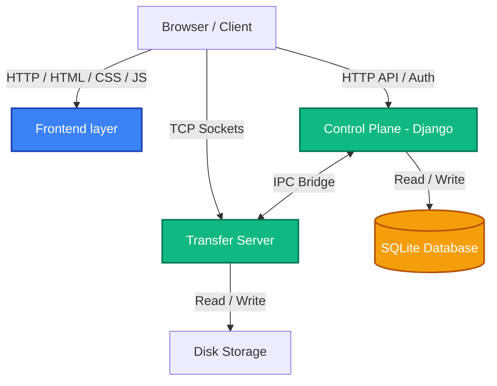

# High-Performance File Sharing Platform

A robust, full-stack file sharing platform engineered for large-scale file transfers, fine-grained access control, and a state-of-the-art interactive user interface. This project demonstrates advanced software engineering principles, moving beyond basic CRUD applications to incorporate systems-level programming concepts, resilient networking, and highly optimized frontend implementations.

---

## Architecture Overview

The system is designed with a decoupled, event-driven architecture, separating the metadata management from the actual heavy-lifting of file transfers.

1. **Control Plane (Django)**: The central nervous system of the application. It handles user authentication, session management, file metadata (size, checksums, visibility), access control policies, and system-wide activity logging. 
2. **Transfer Server (Python Socket/TCP)**: A multithreaded, systems-level transfer server designed specifically for high-speed, chunked file transfers. It bypasses standard HTTP overhead for raw performance, utilizing custom thread pools and chunk managers.
3. **Bridge & IPC**: The Control Plane and Transfer Server communicate via an Inter-Process Communication (IPC) bridge (`bridge/ipc.py`). This allows Django (synchronous) to safely interact with the asynchronous/multithreaded Transfer Server using `asgiref` (`sync_to_async`).
4. **Client-Side Engine (Vanilla JS + IndexedDB)**: A completely custom, lightweight frontend engine built without the bloat of frameworks like React or Angular. It manages local chunk assembly, resumability state, and dynamic rendering.

---

## Key Implementation Techniques

### 1. Resumable, Chunk-Based Transfers (Client-Side)
To handle gigabyte-plus file sizes without exhausting memory or failing on dropped connections, the frontend implements a sophisticated chunking engine:
- **HTTP Range Requests**: The client requests files in 5MB chunks using HTTP `Range` headers. 
- **IndexedDB Caching**: As chunks arrive, they are immediately flushed to the browser's local IndexedDB. This ensures that if the browser crashes or the user pauses the download, the exact byte progress is saved locally.
- **Blob Stitching**: Once all chunks are verified in IndexedDB, the JavaScript `Blob` API is used to rapidly stitch the chunks together in memory and trigger a native browser save dialog, subsequently purging the IndexedDB cache.

### 2. High-Performance UI / UX Architecture
The user interface avoids heavy CSS frameworks (like Bootstrap or Tailwind) in favor of a highly optimized, raw CSS3 implementation.
- **Zero-Dependency Styling**: The entire UI is built on native CSS custom properties (variables), Flexbox, and CSS Grid.
- **Hardware-Accelerated Animations**: Complex UI elements—such as the mouse-tracking tech gradients and 3D rotating grids on the authentication pages—are achieved using native CSS `transform` and `@keyframes`, ensuring they run on the GPU at 60fps without freezing the main JavaScript thread.
- **Modular Static Assets**: CSS and JS are logically separated into `auth.css`, `dashboard.css`, etc., allowing for aggressive browser caching.

### 3. Comprehensive Activity Logging
A custom Django Middleware (`users/middleware.py`) captures all requests in real-time.
- **Audit Trails**: Every action (viewing a page, downloading a file, failed login attempts) is captured along with the user's IP address, HTTP method, and timestamp.
- **Noise Filtering**: The middleware intelligently filters out static asset requests (CSS/JS/images) to prevent database bloat, ensuring the `ActivityLog` table remains lean and queryable for security audits.

### 4. Dynamic Storage Visualization
The dashboard features a real-time, segmented storage usage indicator.
- **On-the-fly Categorization**: Files are parsed by extension and grouped into categories (Video, Photo, Document, etc.).
- **Dynamic CSS Injection**: The backend calculates precise storage percentages and injects them directly into the inline styles of the flex-basis segments, creating a flawless, responsive progress bar without needing a charting library like Chart.js.

---

## Project Structure

```text
file-sharing/
├── backend/
│   ├── bridge/                 # IPC communication between Django and Transfer Server
│   ├── control_plane/          # Core Django project settings & configuration
│   ├── dashboard/              # Main UI views and file categorization logic
│   ├── files/                  # Django models (File, FileTransfer, ServerNode)
│   ├── policies/               # Granular access control and permission engine
│   ├── storage/                # Physical disk storage for uploaded files
│   ├── transfer_server/        # Multithreaded TCP socket server for raw data transfer
│   └── users/                  # Custom Auth, Activity Logging Middleware & Models
└── frontend/
    ├── static/                 # Modular, cached CSS and JS assets
    │   ├── css/                # auth.css, dashboard.css
    │   └── js/                 # auth.js, dashboard.js
    └── templates/              # HTML templates
```

## Architecture Workflow



## Getting Started

1. **Navigate to the Backend Directory**: `cd backend`
2. **Install Dependencies**: `pip install -r requirements.txt`
3. **Run Migrations**: `python manage.py migrate`
4. **Start the Development Server**: `python manage.py runserver`
5. Access the platform at `http://localhost:8000`.