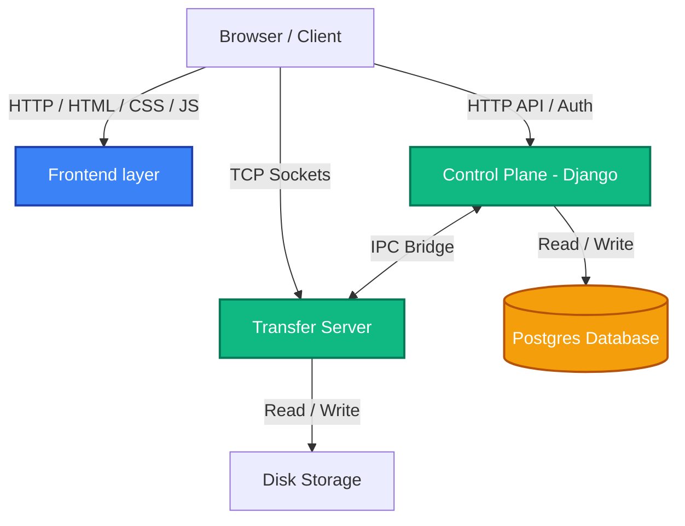

# High-Performance File Sharing Platform

A full-stack file sharing platform for large file transfers, combining a Django control plane, an event-driven async transfer protocol, and a resilient chunked-transfer client — built to survive crashes, restarts, and dropped connections without losing progress.

---

## Architecture Overview

The system separates metadata/access management from file transfer, and supports two independent transfer paths:

1. **Control Plane (Django)** — Handles authentication, session management, file metadata (size, checksums, visibility), access policies, and activity logging. Also serves web-based downloads directly via HTTP Range requests.
2. **Async Transfer Server (Python `asyncio`, raw TCP)** — An event-driven socket server (`asyncio.start_server`) built for high-throughput chunked transfers outside the HTTP stack, using a bounded `AsyncWorkerPool` to cap concurrency and apply backpressure (`SERVER_BUSY`) under load. Exercised via a dedicated TCP client protocol.
3. **Bridge & IPC** — Connects the Django control plane to the async transfer server via `bridge/ipc.py`, letting Django's synchronous views safely call into async code through `asgiref` (`sync_to_async`).
4. **Client-Side Engine (Vanilla JS + IndexedDB)** — A dependency-free frontend managing chunked uploads/downloads, resumable state, and progress UI.

---

## Key Implementation Techniques

### 1. Crash-Resilient Uploads (Server-Persisted)
Upload progress is persisted to disk, not just held in memory, on both transfer paths:
- A `ChunkManager` tracks received byte ranges, merging overlapping/out-of-order intervals into a canonical list.
- Progress is written to a `.manifest` file after every chunk. On reconnect — including after a full server restart — the manifest is reloaded, missing byte ranges are recomputed, and the client is told exactly what's still needed (`missing_intervals`).
- On completion, the full file is re-hashed (SHA-256) and checked against the client's checksum before the manifest is deleted, so even a corrupted partial write is caught at verification rather than failing silently.

### 2. Resumable Downloads (Client-Persisted, HTTP Range-Based)
- The web client fetches files in 5MB chunks using HTTP `Range` requests; Django's `FileResponse` serves the requested byte range natively (`206 Partial Content`).
- Downloaded bytes are tracked in IndexedDB and updated after each completed chunk — surviving not just pauses but full browser crashes and page reloads. On reopening the app, any incomplete download is detected and offered for resume from the exact last chunk, not from zero.
- Completed chunks are stitched into a final `Blob` and saved once the full file is verified present.

### 3. Event-Driven Transfer Protocol (TCP)
- A separate, raw-socket transfer protocol (`transfer_server/`) supports the same upload/download resumability model over a custom async TCP protocol, independent of HTTP — useful for high-throughput transfers outside the browser. Validated via a dedicated test client (`test_client.py`).
- Built on `asyncio` coroutines rather than OS threads, allowing many concurrent connections to be handled on a single event loop via non-blocking I/O, with an `AsyncWorkerPool` providing admission control under load.

### 4. Access Control & Activity Logging
- The `policies/` app enforces per-file visibility and permission checks on upload/download.
- A custom Django middleware (`users/middleware.py`) logs every request — page views, downloads, failed logins — with IP, method, and timestamp, filtering out static-asset noise to keep the audit log queryable.

### 5. Storage Visualization
- The dashboard computes real-time storage usage by file category and renders a segmented usage bar without a charting library.

---

## Project Structure

```text
file-sharing/
├── backend/
│   ├── bridge/                 # IPC between Django and the async Transfer Server
│   ├── control_plane/          # Django project settings & configuration
│   ├── dashboard/               # UI views, HTTP Range downloads, storage stats
│   ├── files/                   # Django models (File, FileTransfer, ServerNode)
│   ├── policies/                # Access control / permission enforcement
│   ├── storage/                 # Physical disk storage for uploaded files
│   ├── transfer_server/         # Async TCP transfer protocol (chunking, checksums, manifests)
│   └── users/                   # Custom Auth, Activity Logging Middleware & Models
└── frontend/
    ├── static/                  # CSS/JS assets
    └── templates/                # Dashboard, auth pages (chunked upload/download logic inline)
```

## Architecture Workflow



## Getting Started

1. **Navigate to the Backend Directory**: `cd backend`
2. **Install Dependencies**: `pip install -r requirements.txt`
3. **Run Migrations**: `python manage.py migrate`
4. **Start the Development Server**: `python manage.py runserver`
5. Access the platform at `http://localhost:8000`.